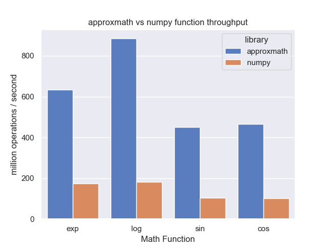

# Fast, Approximate Math Functions for NumPy

`approxmath` is a Python library of fast, approximate math functions for operations on NumPy arrays. On average it is **4-5x faster than NumPy** and has drop-in replacement functions for `log`, `exp`, `cos`, and `sin`.

The approximations were originally made by Jacques-Henri Jourdan and are explained on [Cambium's blog](http://gallium.inria.fr/blog/fast-vectorizable-math-approx/).

### Performance & Accuracy



If your program doesn't depend on the full precision of floating point operations, the performance-accuracy trade-off will probably be worth it, increasing FLOPS throughput 4-5x. However, in some instances numerical instability will result: for example, `approxmath.log(1.0)` is nearly, but not exactly `0.0`.

| Function | Relative Accuracy | ops / second |
|----------|-------------------|--------------|
| exp | `3e-9` | 647 M/sec |
| log | `5e-9` | 896 M/sec |
| cos | `2e-10` | 470 M/sec |
| sin | `2e-9` | 463 M/sec |

Benchmarks were run on a 2019 MacBook Pro (1.4 GHz Quad-Core Intel Core i5), with Python 3.9.9 and NumPy 1.21.4.

### Drop-in Replacement

```python
import approxmath as npa
import numpy as np

npa.sin(np.array([-np.pi/2, 0.0, np.pi/2]))
# array([-1.,  0.,  1.])

npa.log(np.array([1.0, np.e, np.e**2]))
# array([4.53119942e-09, 1.00000000e+00, 2.00000000e+00])

npa.cos(np.array([-2*np.pi/3, 0.0, 2*np.pi/3]))
# array([-0.5,  1. , -0.5])

npa.exp(np.array([-1., 0., 1.]))
# array([0.36787944, 1.        , 2.71828183])
```

### Installation

```sh
$ pip install approxmath
```

`approxmath` is released under the MIT license.
